# BT04 - REST API pre správu poznámok

## Notes CRUD

### GET /api/notes - Zoznam všetkých poznámok

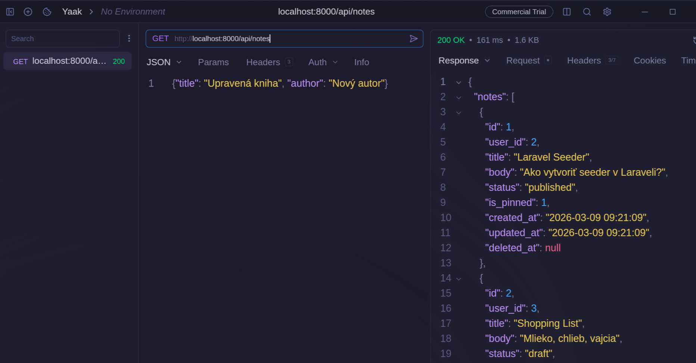

### GET /api/notes/1 - Detail poznámky

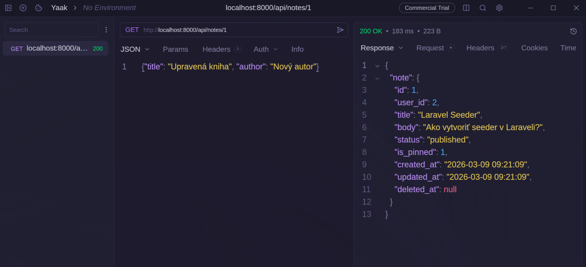

### POST /api/notes - Vytvorenie poznámky

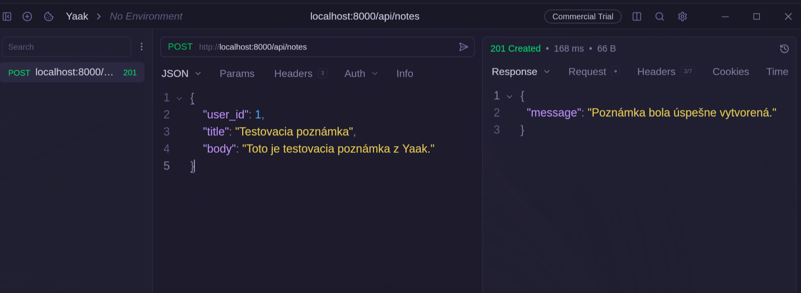

### PUT /api/notes/1 - Aktualizácia poznámky

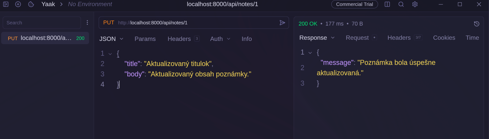

### DELETE /api/notes/3 - Odstránenie poznámky (soft delete)

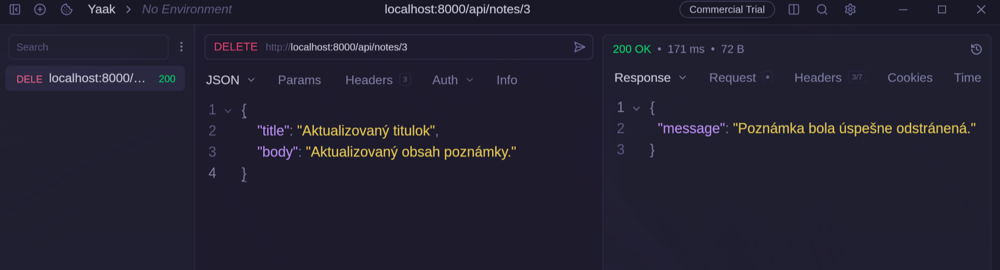

---

## Notes - vlastné endpointy

### GET /api/notes/stats/status - Štatistiky podľa statusu

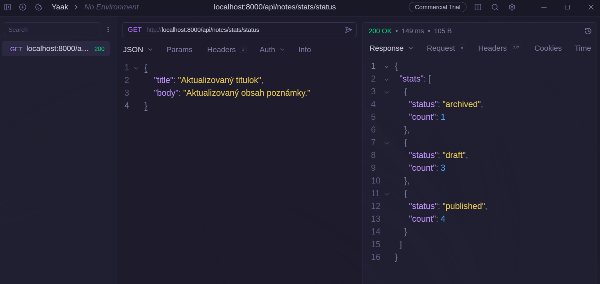

### PATCH /api/notes/actions/archive-old-drafts - Archivácia starých konceptov

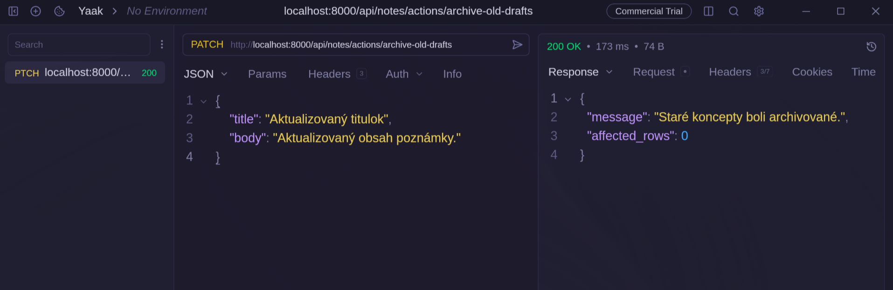

### PATCH /api/notes/1/toggle-pin - Prepnutie pripnutia poznámky

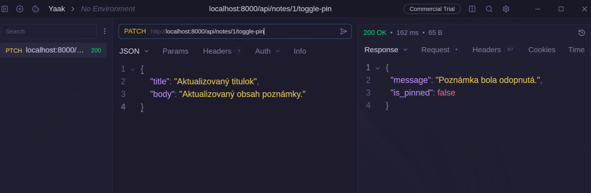

### GET /api/users/2/notes - Poznámky používateľa s kategóriami

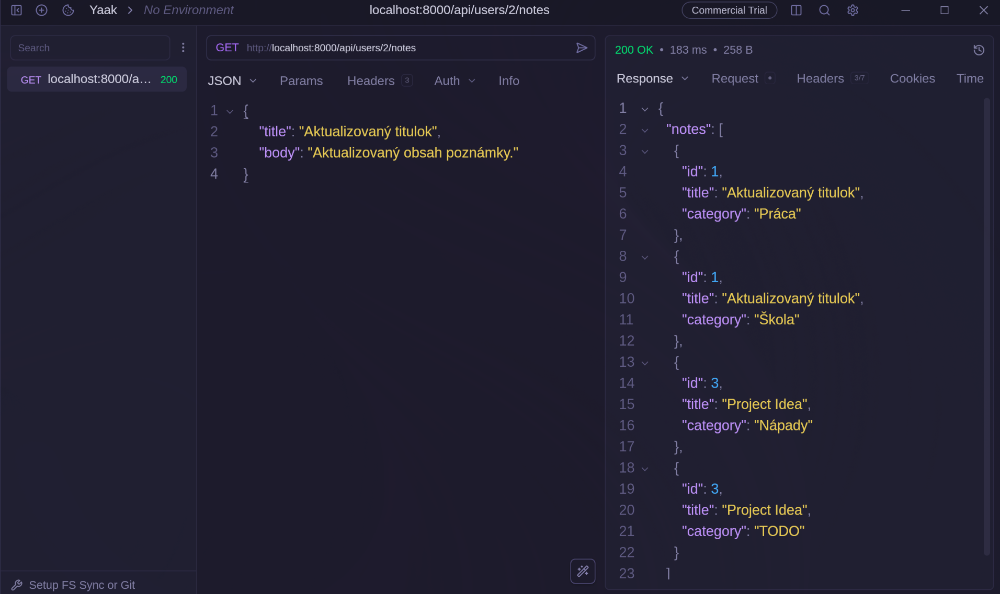

### GET /api/notes-actions/search?q=Laravel - Vyhľadávanie v poznámkach

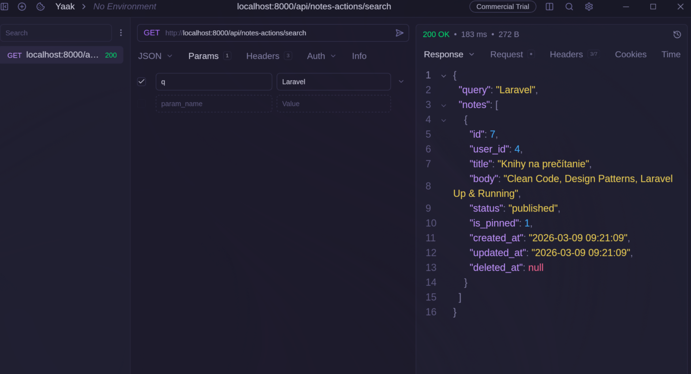

---

## Categories CRUD

### GET /api/categories - Zoznam všetkých kategórií

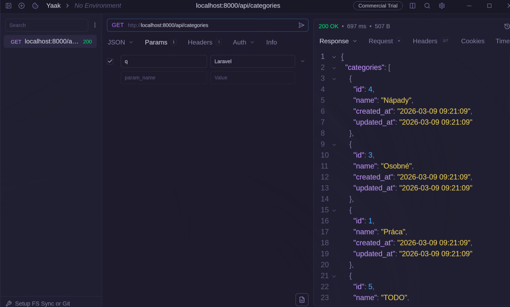

### GET /api/categories/1 - Detail kategórie

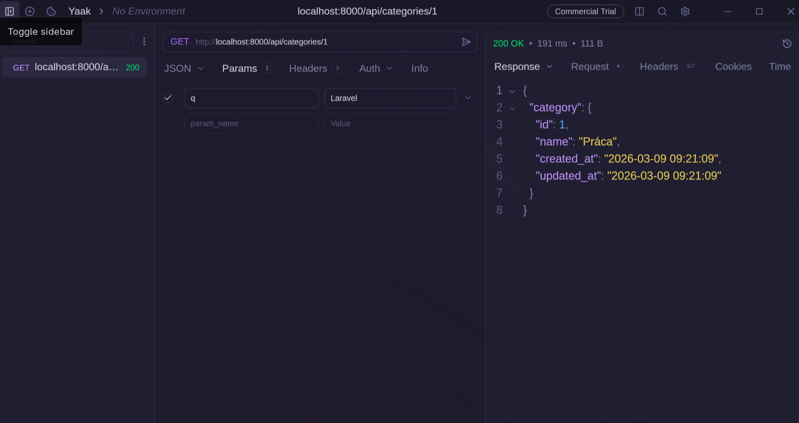

### POST /api/categories - Vytvorenie kategórie

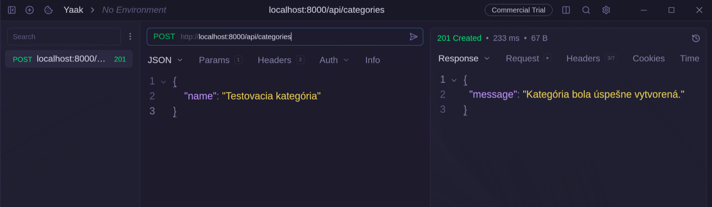

### PUT /api/categories/1 - Aktualizácia kategórie

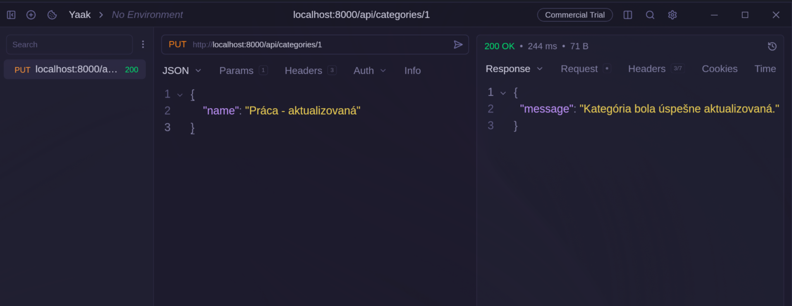

### DELETE /api/categories/5 - Odstránenie kategórie

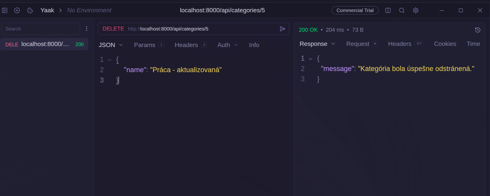
